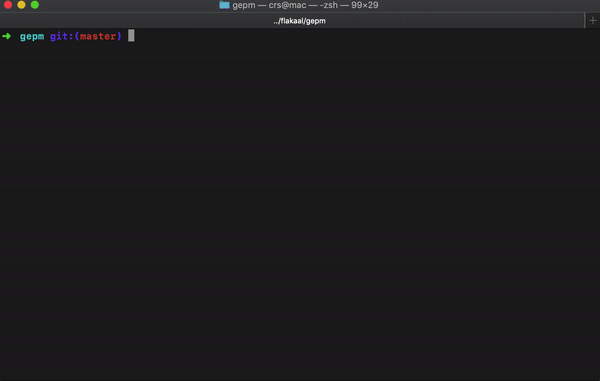

# GEPM [](https://github.com/flakaal/gepm)
> Go Express Package Manager


GEPM is a terminal browser, installer and manager for go packages.

  - Search for packages
  - Install a package by just typing the number
  - All packages dependencies are saved in ```packages.json``` so you can clone and run your projects on new environments

<p align="center">
  
</p>


### Installation

```sh
$ go get github.com/flakaal/gepm
```

### Todos

 - Faster api search

### Acknowledgement
 - <a href="https://github.com/daviddengcn/gcse">gcse</a> by <a href="https://github.com/daviddengcn">daviddengcn</a> for package search.
 - <a href="https://github.com/briandowns/spinner">spinner</a> by <a href="https://github.com/briandowns">briandowns</a>  for loading spinners.

License
----

MIT


**Free Software, Hell Yeah!**
